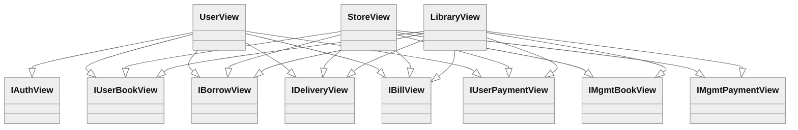
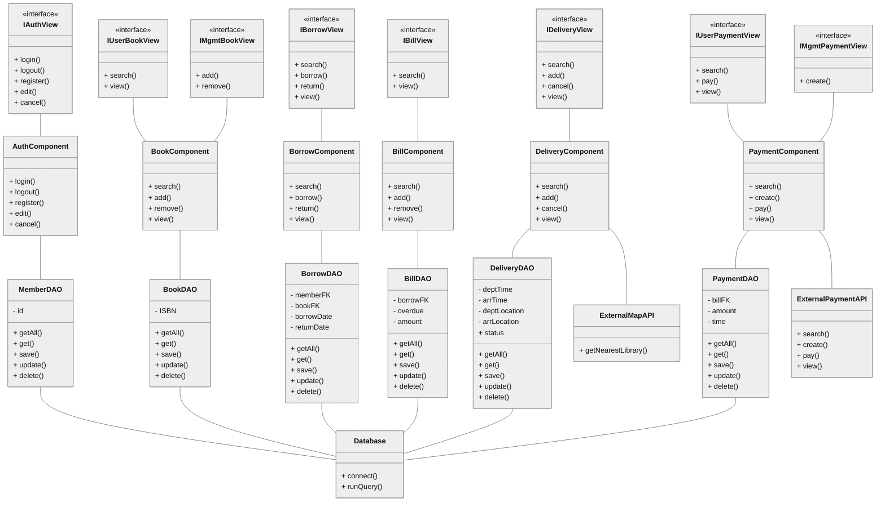

# Lab 2

```mermaid
%%{init:{"theme":"neutral"}}%%
classDiagram
%% Presentation concrete implementation
UserView --|> IAuthView
UserView --|> IUserBookView
UserView --|> IBorrowView
UserView --|> IDeliveryView
UserView --|> IBillView
UserView --|> IUserPaymentView
StoreView --|> IUserBookView
StoreView --|> IMgmtBookView
StoreView --|> IBorrowView
StoreView --|> IDeliveryView
StoreView --|> IBillView
StoreView --|> IUserPaymentView
StoreView --|> IMgmtPaymentView
LibraryView --|> IUserBookView
LibraryView --|> IMgmtBookView
LibraryView --|> IBorrowView
LibraryView --|> IDeliveryView
LibraryView --|> IBillView
LibraryView --|> IUserPaymentView
LibraryView --|> IMgmtPaymentView
```

```mermaid
%%{init:{"theme":"neutral"}}%%
classDiagram
%% Presentation -- Business
IAuthView -- AuthComponent
IUserBookView -- BookComponent
IMgmtBookView -- BookComponent
IBorrowView -- BorrowComponent
IDeliveryView -- DeliveryComponent
IBillView -- BillComponent
IUserPaymentView -- PaymentComponent
IMgmtPaymentView -- PaymentComponent

%% Presentation interface
class IAuthView {
  <<interface>>
  + login()
  + logout()
  + register()
  + edit()
  + cancel()
}
class IUserBookView {
  <<interface>>
  + search()
  + view()
}
class IMgmtBookView {
  <<interface>>
  + add()
  + remove()
}
class IBorrowView {
  <<interface>>
  + search()
  + borrow()
  + return()
  + view()
}
class IDeliveryView {
  <<interface>>
  + search()
  + add()
  + cancel()
  + view()
}
class IBillView {
  <<interface>>
  + search()
  + view()
}
class IUserPaymentView {
  <<interface>>
  + search()
  + pay()
  + view()
}
class IMgmtPaymentView {
  <<interface>>
  + create()
}

%% Business -- Data Access
AuthComponent -- MemberDAO
BookComponent -- BookDAO
BorrowComponent -- BorrowDAO
DeliveryComponent -- DeliveryDAO
BillComponent -- BillDAO
PaymentComponent -- PaymentDAO

%% Business
class AuthComponent {
  + login()
  + logout()
  + register()
  + edit()
  + cancel()
}
class BookComponent {
  + search()
  + add()
  + remove()
  + view()
}
class BorrowComponent {
  + search()
  + borrow()
  + return()
  + view()
}
class DeliveryComponent {
  + search()
  + add()
  + cancel()
  + view()
}
class BillComponent {
  + search()
  + add()
  + remove()
  + view()
}
class PaymentComponent {
  + search()
  + create()
  + pay()
  + view()
}

%% Business -- External API
DeliveryComponent -- ExternalMapAPI
PaymentComponent -- ExternalPaymentAPI

%% Business external components
class ExternalMapAPI {
  + getNearestLibrary()
}
class ExternalPaymentAPI {
  + search()
  + create()
  + pay()
  + view()
}

%% Data Access -- Database
MemberDAO -- Database
BookDAO -- Database
BorrowDAO -- Database
DeliveryDAO -- Database
BillDAO -- Database
PaymentDAO -- Database

%% Data Access
class MemberDAO {
  - id
  + getAll()
  + get()
  + save()
  + update()
  + delete()
}
class BookDAO {
  - ISBN
  + getAll()
  + get()
  + save()
  + update()
  + delete()
}
class BorrowDAO {
  - memberFK
  - bookFK
  - borrowDate
  - returnDate
  + getAll()
  + get()
  + save()
  + update()
  + delete()
}
class DeliveryDAO {
  - deptTime
  - arrTime
  - deptLocation
  - arrLocation
  + status
  + getAll()
  + get()
  + save()
  + update()
  + delete()
}
class BillDAO {
  - borrowFK
  - overdue
  - amount
  + getAll()
  + get()
  + save()
  + update()
  + delete()
}
class PaymentDAO {
  - billFK
  - amount
  - time
  + getAll()
  + get()
  + save()
  + update()
  + delete()
}

%% Database
class Database {
  + connect()
  + runQuery()
}
```
